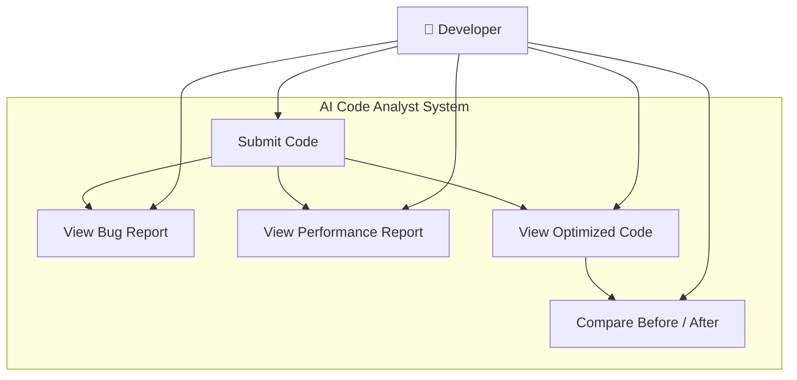

# Diagram 1 — Use Case Diagram

**Actors:**

- **Developer** — the primary user who submits Python code and consumes reports.

**Use Cases:**

- **Submit Code** — user pastes Python code into the web interface and triggers the pipeline.
- **View Bug Report** — user reads detected bugs, severity levels, and fix suggestions.
- **View Performance Report** — user reads execution time, complexity, and memory usage.
- **View Optimized Code** — user sees the AI-generated optimized version of their code.
- **Compare Before / After** — user views side-by-side diff of original vs. optimized code with speedup metrics.
