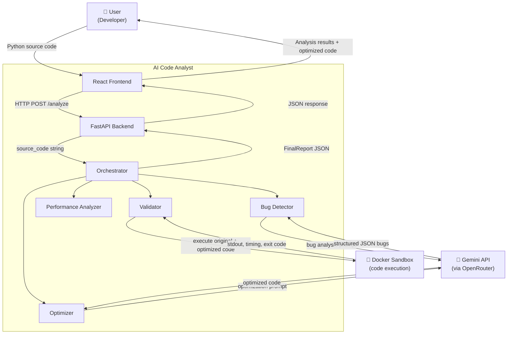

# Diagram 3 — Context Diagram

**System Boundary:** AI Code Analyst — encompasses all backend services, agents, and the React frontend.

**External Entities:**

- **User** — submits Python code, receives structured analysis report.
- **Gemini API (via OpenRouter)** — called by Bug Detector and Optimizer for AI-powered analysis and code generation.
- **Docker Sandbox** — isolated execution environment used by the Validator to safely run user-submitted and optimized code.
