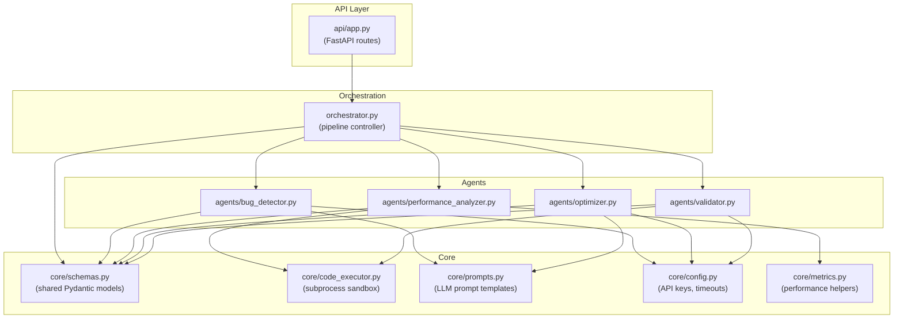

# Diagram 4 — Component Diagram

**Module Relationships:**

- `api/app.py` — FastAPI entry point; receives HTTP requests and delegates to the Orchestrator.
- `orchestrator.py` — coordinates all 4 agents in sequence; constructs the `FinalReport`.
- `agents/` — each agent has a single responsibility and communicates exclusively via Pydantic models from `core/schemas.py`.
- `core/schemas.py` — shared data contracts; defines `UserInput`, `BugReport`, `PerformanceReport`, `OptimizationResult`, `ValidationResult`, and `FinalReport`.
- `core/code_executor.py` — used by `validator.py` (and `performance_analyzer.py`) to safely run Python code in a subprocess with timing and memory tracking.
- `core/prompts.py` — LLM prompt templates used by `bug_detector.py` and `optimizer.py`.
- `core/config.py` — centralizes API keys, sandbox timeout, and memory limits.
